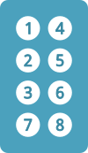

# Pixels

To simulate pixels, we use the Unicode <br>
characters from the **[Braille Patterns]**.

<br>

**Range :**  `0x2800 - 0x28FF`

<br>

```
⠀⠁⠂⠃⠄⠅⠆⠇    ⡀⡁⡂⡃⡄⡅⡆⡇    ⢀⢁⢂⢃⢄⢅⢆⢇    ⣀⣁⣂⣃⣄⣅⣆⣇
⠈⠉⠊⠋⠌⠍⠎⠏    ⡈⡉⡊⡋⡌⡍⡎⡏    ⢈⢉⢊⢋⢌⢍⢎⢏    ⣈⣉⣊⣋⣌⣍⣎⣏
⠐⠑⠒⠓⠔⠕⠖⠗    ⡐⡑⡒⡓⡔⡕⡖⡗    ⢐⢑⢒⢓⢔⢕⢖⢗    ⣐⣑⣒⣓⣔⣕⣖⣗
⠘⠙⠚⠛⠜⠝⠞⠟    ⡘⡙⡚⡛⡜⡝⡞⡟    ⢘⢙⢚⢛⢜⢝⢞⢟    ⣘⣙⣚⣛⣜⣝⣞⣟
⠠⠡⠢⠣⠤⠥⠦⠧    ⡠⡡⡢⡣⡤⡥⡦⡧    ⢠⢡⢢⢣⢤⢥⢦⢧    ⣠⣡⣢⣣⣤⣥⣦⣧
⠨⠩⠪⠫⠬⠭⠮⠯    ⡨⡩⡪⡫⡬⡭⡮⡯    ⢨⢩⢪⢫⢬⢭⢮⢯    ⣨⣩⣪⣫⣬⣭⣮⣯
⠰⠱⠲⠳⠴⠵⠶⠷    ⡰⡱⡲⡳⡴⡵⡶⡷    ⢰⢱⢲⢳⢴⢵⢶⢷    ⣰⣱⣲⣳⣴⣵⣶⣷
⠸⠹⠺⠻⠼⠽⠾⠿    ⡸⡹⡺⡻⡼⡽⡾⡿    ⢸⢹⢺⢻⢼⢽⢾⢿    ⣸⣹⣺⣻⣼⣽⣾⣿
```

<br>
<br>

## Conversion

*Pixel Coordinates ➞ Braille Patterns*

<br>



      Due to braille's irregular order of dots, <br>
      blocks of  `2 x 4`  pixels have to be <br>
      converted following the table below.

<br>
<br>
<br>

| Braille | X | Y | | Braille | X | Y |
|:-------:|:-:|:-:|-|:-------:|:-:|:-:|
| **1** | `1` | `1` | | **5** | `2` | `2`
| **2** | `1` | `2` | | **6** | `2` | `3`
| **3** | `1` | `3` | | **7** | `1` | `4`
| **4** | `2` | `1` | | **8** | `2` | `4`


<br>


<!----------------------------------------------------------------------------->

[Braille Patterns]: https://unicode-table.com/en/blocks/braille-patterns/
