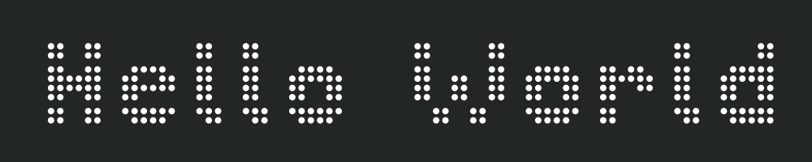

 

[![Badge License]][License]   
[![Badge Deno]][Deno]

 

# 

*An innovative, never finished, enterprise grade*  
*implementation of everyone's favorite program.*

 
 

[![Button Discussions]][Discussions]   
[![Button Roadmap]][Roadmap]

 
 

## Documentation

 

[![Button Pixels]][Pixels]

 

<!----------------------------------------------------------------------------->

[Discussions]: https://github.com/orgs/EnterpriseSoftwareProjectsFoundation/discussions 'Where you can discuss this project.'
[Deno]: https://deno.land/ 'The JavaScript runtime used for this project.'

[Roadmap]: Documentation/Roadmap.md
[Preview]: Assets/Preview.png
[License]: LICENSE 'This project is licensed under AGPLv3'
[Pixels]: Documentation/Pixels.md 'How pixels are rendered'

[#]: #

<!----------------------------------[ Badges ]--------------------------------->

[Badge License]: https://img.shields.io/badge/-AGPL3-015d93.svg?style=for-the-badge&labelColor=blue&logoColor=white&logo=GNU
[Badge Deno]: https://img.shields.io/badge/Deno-7c6c47.svg?style=for-the-badge&labelColor=A5915F&logoColor=white&logo=Deno

<!---------------------------------[ Buttons ]--------------------------------->

[Button Discussions]: https://img.shields.io/badge/Discussions-blue?style=for-the-badge&logoColor=white&logo=AskUbuntu
[Button Roadmap]: https://img.shields.io/badge/Roadmap-00A98F?style=for-the-badge&logoColor=white&logo=GoogleMaps
[Button Pixels]: https://img.shields.io/badge/Pixels-EF2D5E?style=for-the-badge&logoColor=white&logo=ROS